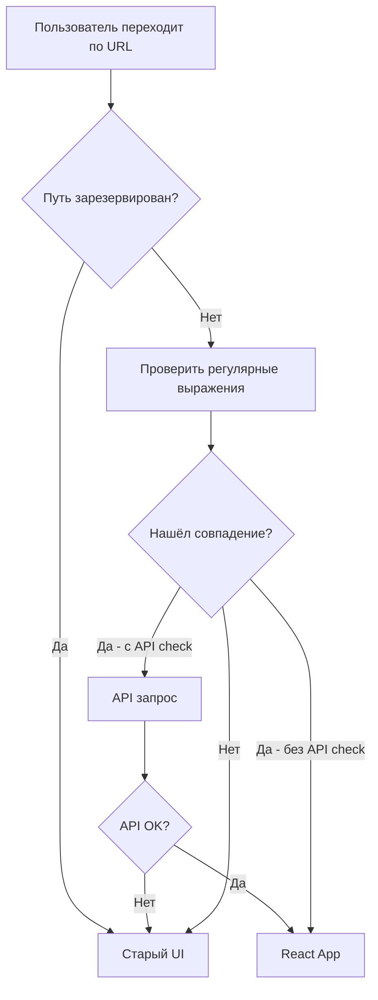

# Gitea-React-Adapter

## Назначение

Файл `web_src/js/bridge/gitea-react-adapter.js` отвечает за **интеграцию React-приложения (MFE) с GiteaBridge** — механизмом переключения между старым (Go Templates) и новым (React) фронтендами.

### Основные задачи:

1. **Определение, должен ли React обработать путь**
   - Проверяет URL против шаблонов регулярных выражений
   - Для некоторых путей делает API-запрос для подтверждения существования ресурса

2. **Инициализация React как Micro Frontend**
   - Если путь подходит, переключает GiteaBridge на React-сборку
   - Меняет маршрут в GiteaBridge на `export-app`

3. **Обработка навигации**
   - Использует `window.history.pushState()` для бесшовного перехода
   - Позволяет браузеру корректно работать с историей

---

## Зарезервированные префиксы (идут в старый UI)

| Префикс | Назначение |
|---------|------------|
| `/admin/**` | Админка |
| `/user/**` | Профиль пользователя |
| `/org/**` | Организации (legacy) |
| `/notifications/**` | Уведомления |
| `/pulls/**` | Пулреквесты (legacy) |
| `/repo/**` | Репозитории (legacy) |

---

## Соответствие роутов: browser-router ↔ gitea-react-adapter

### 🔴 Важное правило

**Если добавляем новый роут в `browser-router.tsx`, нужно добавить соответствующее регулярное выражение в `gitea-react-adapter.js`.**

---

### Активные роуты

| browser-router | gitea-react-adapter (regex) | Путь | API Check |
|----------------|----------------------------|------|-----------|
| `organizationRepoRoute` | `PROJECT_RE = /^\/([^/]+)$/` | `/{org}` | ✅ Да |
| `repoCodeRoute` | `REPO_RE = /^\/([^/]+)\/([^/]+)$/` | `/{org}/{repo}` | ✅ Да |
| `repoBranchesRoute` | `BRANCHES_RE = /^\/([^/]+)\/([^/]+)\/branches$/` | `/{org}/{repo}/branches` | ❌ Нет |
| `repoPullsCreateRoute` | `PULLS_CREATE_RE = /^\/([^/]+)\/([^/]+)\/pulls\/create$/` | `/{org}/{repo}/pulls/create` | ❌ Нет |
| `pullCommitsRoute` | `PULL_COMMITS_RE = /^\/([^/]+)\/([^/]+)\/pulls\/(\d+)\/commits$/` | `/{org}/{repo}/pulls/{id}/commits` | ❌ Нет |

---

### Закомментированные роуты (в разработке)

| browser-router | gitea-react-adapter | Путь | Статус |
|----------------|---------------------|------|--------|
| `repoCodeSelectedBranchRoute` | ❌ Отсутствует | `/{org}/{repo}/src/branch/{branchName}` | Не в адаптере |
| `repoCodeSelectedTagRoute` | ❌ Отсутствует | `/{org}/{repo}/src/tag/{tagName}` | Не в адаптере |
| `fileViewRoute` | ❌ Отсутствует | `/{org}/{repo}/src/branch/*` | Не в адаптере |
| `repoCommitsRoute` | ❌ Отсутствует | `/{org}/{repo}/commits/branch/*` | Не в адаптере |
| `pullFilesRoute` | ❌ Отсутствует | `/{org}/{repo}/pulls/{id}/files` | Не в адаптере |
| `repoPullRoute` | ❌ Отсутствует | `/{org}/{repo}/pulls/{id}` | Не в адаптере |
| `repoPullsRoute` | ❌ Отсутствует | `/{org}/{repo}/pulls` | Не в адаптере |

---

## Как добавить новый роут

### Шаг 1: Добавить путь в `shared/config/router.ts`

```typescript
repository: {
  // ...
  newFeature: '/:orgName/:repoName/new-feature',
}
```

### Шаг 2: Добавить регулярное выражение в `gitea-react-adapter.js`

```javascript
// В массиве routeHandlers (порядок важен: от частных к общим)
{
  name: 'newFeature',
  test: (p) => /^\/([^/]+)\/([^/]+)\/new-feature$/.test(p),
  getMappingFromRoute: (p) => {
    const [, org, repo] = p.match(/^\/([^/]+)\/([^/]+)\/new-feature$/);
    return { org, repo };
  },
  // Добавить API check, если нужно подтвердить существование ресурса
  // getCheckAPIUrl: ({ org, repo, basename }) => {
  //   return `${basename}${REACT_APP_PREFIX}${API_PREFIX}/projects/${org}/repos/${repo}/new-feature`;
  // },
},
```

### Шаг 3: Создать роут в `browser-router.tsx`

```typescript
import { newFeatureRoute } from '~pages/NewFeature';

// В нужном layout-контейнере:
{
  lazy: RepoLayout,
  children: [newFeatureRoute],
}
```

---

## Как работает проверка роутов



---

## Примеры API check

### Для роутов с API check (repo, project):

```javascript
getCheckAPIUrl: ({ org, repo, basename }) => {
  return `${basename}${REACT_APP_PREFIX}${API_PREFIX}/projects/${org}/repos/${repo}`;
}
```

### Ручки для проверки:
- `/{org}` → `/apifront/web/v2/projects/{org}`
- `/{org}/{repo}` → `/apifront/web/v2/projects/{org}/repos/{repo}`
